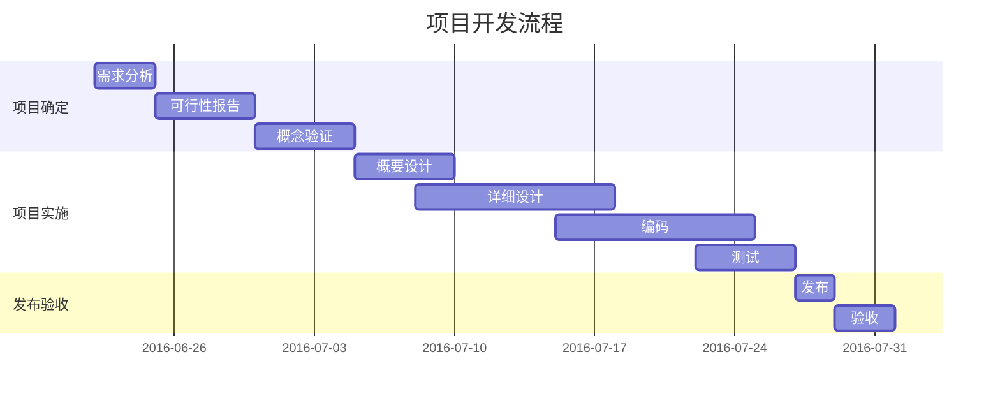

## 甘特图 (gantt)

甘特图是一类条形图, 由 Karol Adamiechi 在 1896 年提出, 而在 1910 年 Henry Gantt 也独立的提出了此种图形表示. 通常用在对项目终端元素和总结元素的开始及完成时间进行的描述.

### 示例

```
gantt
  title 项目开发流程
  section 项目确定
    需求分析       :a1, 2016-06-22, 3d
    可行性报告     :after a1, 5d
    概念验证       : 5d
  section 项目实施
    概要设计      :2016-07-05, 5d
    详细设计      :2016-07-08, 10d
    编码          :2016-07-15, 10d
    测试          :2016-07-22, 5d
  section 发布验收
    发布: 2d
    验收: 3d
```



### 标记

| 标记 | 简介 |
| -- | -- |
| title | 标题 |
| dateFormat | 日期格式 |
| section | 模块 |
| Completed | 已经完成 |
| Active | 当前正在进行 |
| Future | 后续待处理 |
| crit | 关键阶段 |
| 日期缺失 | 默认从上一项完成后 |

## 参考

- [官方文档](http://mermaid-js.github.io/mermaid/)
