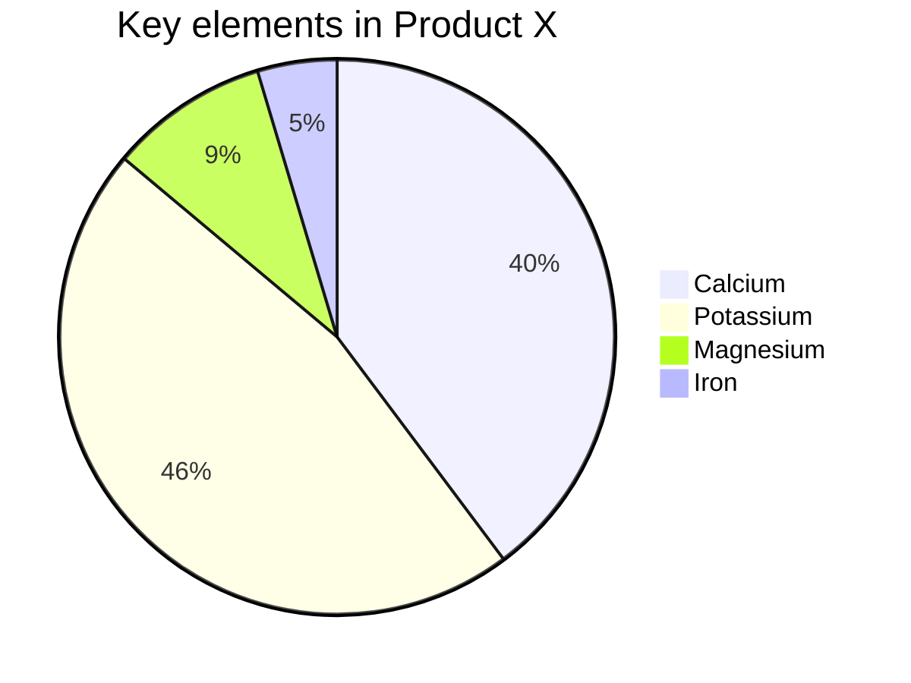

## 饼图

饼图是展示百分比的方式之一

```
[pie] [title] [titlevalue] (OPTIONAL)
"[datakey1]" : [dataValue1]
"[datakey2]" : [dataValue2]
"[datakey3]" : [dataValue3]
```

- 使用 `pie` 关键字创建饼图
- `title` 关键字表示后面携带着饼图的标题
- 数据列表为 `key: value` 对, key 作为 label, value 作为值

```
pie
  title Key elements in Product X
  "Calcium" : 42.96
  "Potassium" : 50.05
  "Magnesium" : 10.01
  "Iron" :  5
```



## 参考

- [官方文档](http://mermaid-js.github.io/mermaid/)
