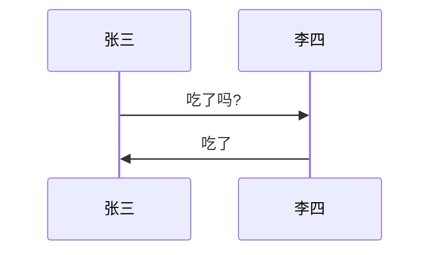
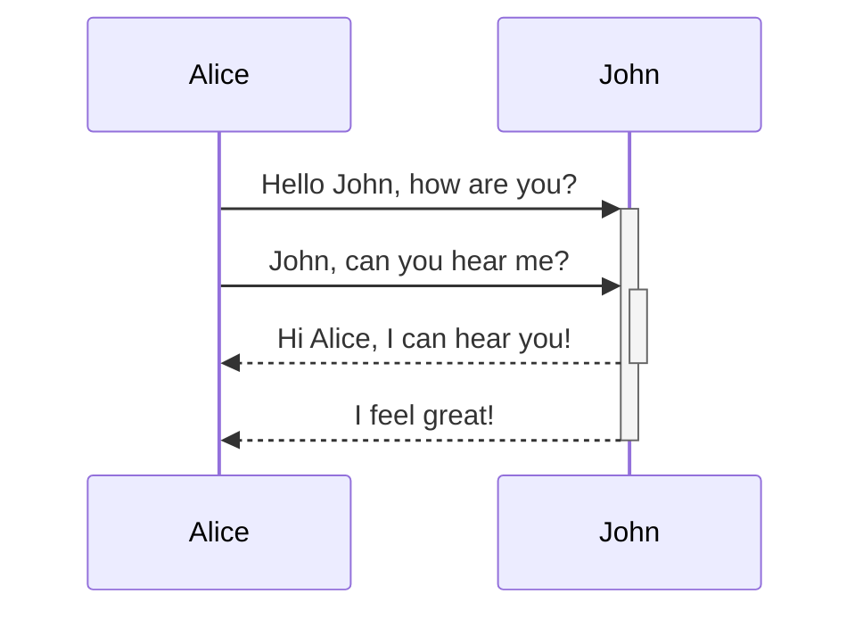
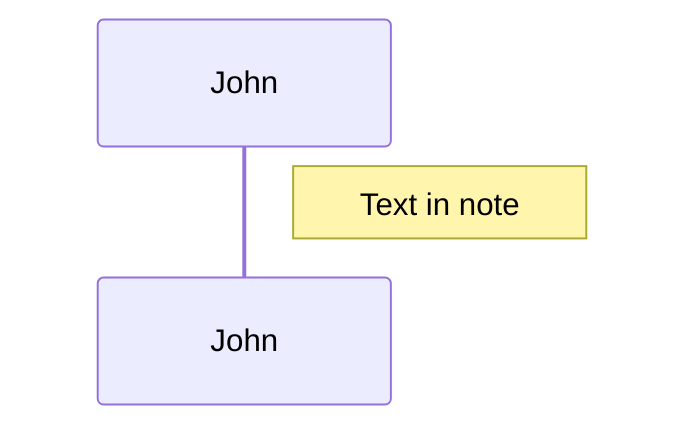
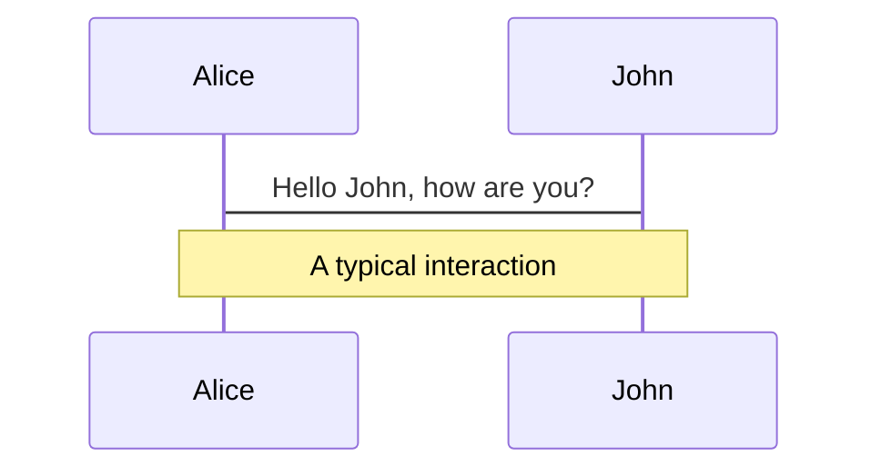
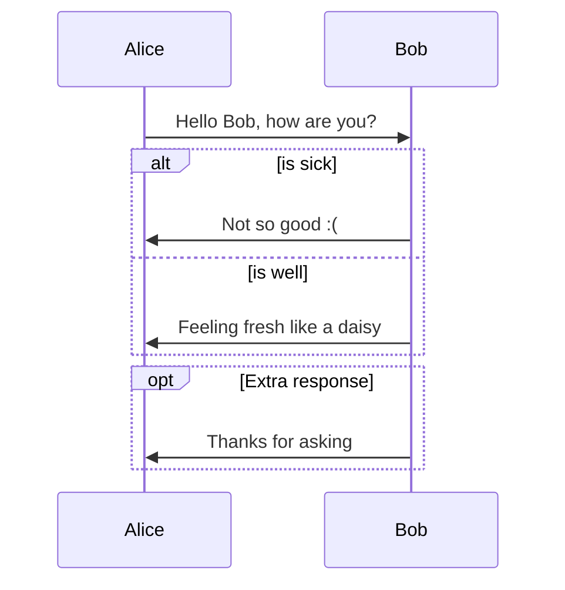
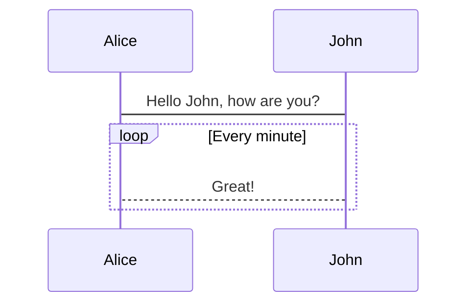
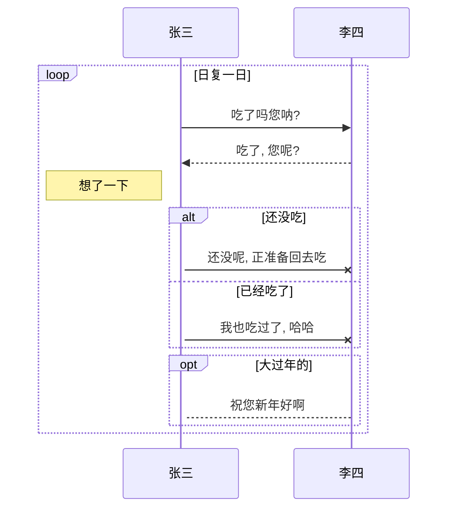
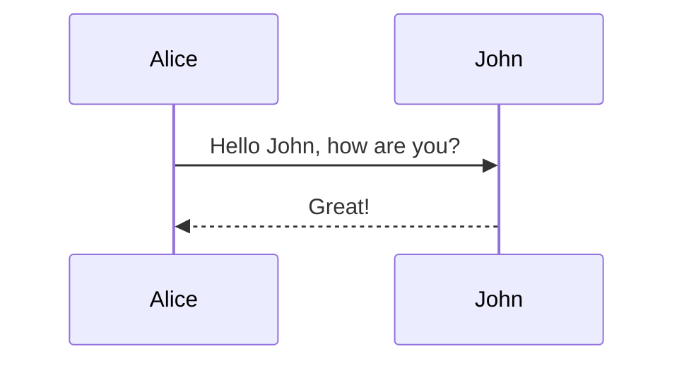
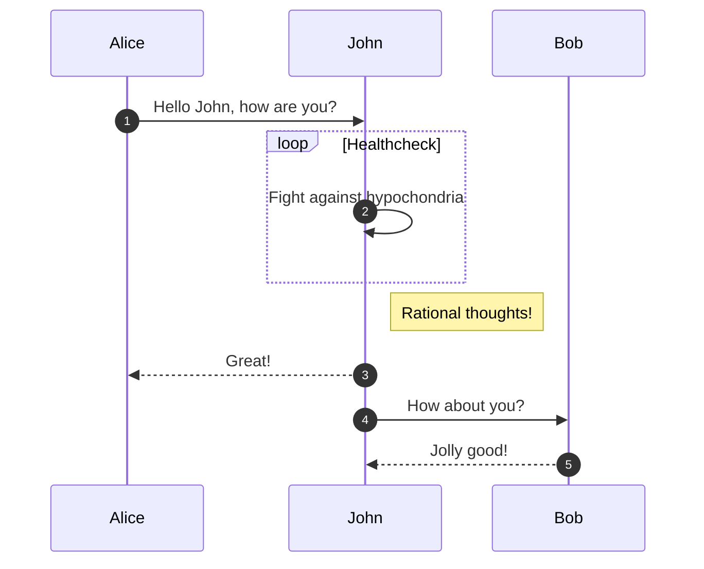

## 时序图

### 语法

```
sequenceDiagram
  [参与者1][消息线][参与者2]:消息体
```

### 示例

```
sequenceDiagram
  张三->>李四: 吃了吗?
  李四->>张三: 吃了
```



### 参与者

#### 简单语法

```
sequenceDiagram
  参与者 1 ->> 参与者2 : 消息体
```

#### 声明语法

**使用关键字 `as` 来命名别名**

```
sequenceDiagram
  participant 参与者 1
  participant 参与者 2
  ...
  participant 简称 as 参与者 3
```

### 消息线

| 类型 | 描述 |
| -- | -- |
| `->` | 无箭头的实线 |
| `-–>` | 无箭头的虚线 |
| `->>` | 有箭头的实线 |
| `-–>>` | 有箭头的虚线 |
| `-x` | 末端为叉的实线 (表示异步) |
| `-–x` | 末端为叉的虚线 (表示异步) |

### 处理状态

在消息线末尾增加 `+` , 则消息接收者进入当前消息的 "处理中" 状态,
在消息线末尾增加 `-` , 则消息接收者离开当前消息的 "处理中" 状态.

或者使用以下语法直接说明某个参与者进入和离开 "处理中" 状态:

```
activate 参与者
deactivate 参与者
```

**可以对同一参与者进行堆叠激活**

```
sequenceDiagram
  Alice->>+John: Hello John, how are you?
  Alice->>+John: John, can you hear me?
  John-->>-Alice: Hi Alice, I can hear you!
  John-->>-Alice: I feel great!
```



### 标注

#### 语法

```
Note 位置表述 参与者: 标注文字
```

| 位置表述 | 含义 |
| -- | -- |
| right of | 右侧 |
| left of | 左侧 |
| over | 在当中, 可以横跨多个参与者 |

```
sequenceDiagram
  participant John
  Note right of John: Text in note
```



```
sequenceDiagram
  Alice->John: Hello John, how are you?
  Note over Alice,John: A typical interaction
```



### 逻辑结构

#### 判断

```
alt 条件 1 描述
  分支 1 描述语句
else 条件 2 描述 # else 分支可选
  分支 2 描述语句
else ...
  ...
end
```

如果遇到可选的情况, 即没有 `else` 分支的情况, 使用如下语法:

```
opt 条件描述
  分支描述语句
end
```

```
sequenceDiagram
  Alice->>Bob: Hello Bob, how are you?
  alt is sick
    Bob->>Alice: Not so good :(
  else is well
    Bob->>Alice: Feeling fresh like a daisy
  end
  opt Extra response
    Bob->>Alice: Thanks for asking
  end
```



#### 循环

```
loop 循环的条件
  循环体描述语句
end
```

```
sequenceDiagram
  Alice->John: Hello John, how are you?
  loop Every minute
    John-->Alice: Great!
  end
```



#### 示例

```
sequenceDiagram
  participant z as 张三
  participant l as 李四
  loop 日复一日
    z->>l: 吃了吗您呐?
    l-->>z: 吃了, 您呢?
    activate z
    Note left of z: 想了一下
    alt 还没吃
      z-xl: 还没呢, 正准备回去吃
    else 已经吃了
      z-xl: 我也吃过了, 哈哈
    end
    opt 大过年的
      l-->z: 祝您新年好啊
    end
  end
```



### 并行

```
par [Action 1]
... statements ...
and [Action 2]
... statements ...
and [Action N]
... statements ...
end
```

```
sequenceDiagram
  par [活动 1]
    对象 --> 对象2
  and [活动 2]
    对象 --> 对象3
  end
```

```mermaid
sequenceDiagram
  par [活动 1]
    对象 --> 对象2
  and [活动 2]
    对象 --> 对象3
  end
```

### 背景突出显示

```
rect rgb(0, 255, 0)
... content ...
end
```

```
rect rgba(0, 0, 255, .1)
... content ...
end
```


```
sequenceDiagram
  rect rgba(0, 0, 255, .1)
    对象 --> 对象2
    rect rgb(0, 255, 0)
      对象 --> 对象3
    end
  end
```

```mermaid
sequenceDiagram
  rect rgba(0, 0, 255, .1)
    对象 --> 对象2
    rect rgb(0, 255, 0)
      对象 --> 对象3
    end
  end
```

### 注释

注释必须自己一行, 并且必须以 `%%` (双百分号) 开头

```
sequenceDiagram
  Alice->>John: Hello John, how are you?
  %% this is a comment
  John-->>Alice: Great!
```



### 序列编号

需要在序列图中自动获取每个箭头的编号可以在初始化的时候传入 `showSequenceNumbers` 参数

```js
<script>
  mermaid.initialize({
    sequence: { showSequenceNumbers: true },
  });
</script>
```

或者手动在序列图中使用 `autonumber` 指令

```
sequenceDiagram
  autonumber
  Alice->>John: Hello John, how are you?
  loop Healthcheck
    John->>John: Fight against hypochondria
  end
  Note right of John: Rational thoughts!
  John-->>Alice: Great!
  John->>Bob: How about you?
  Bob-->>John: Jolly good!
```



### 样式

[参考文档](http://mermaid-js.github.io/mermaid/#/sequenceDiagram?id=styling)

## 参考

- [官方文档](http://mermaid-js.github.io/mermaid/)
