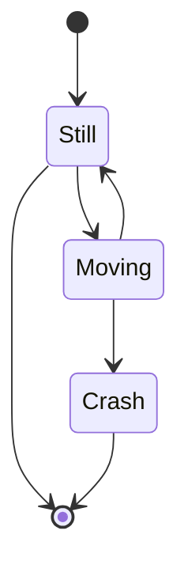
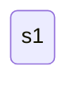
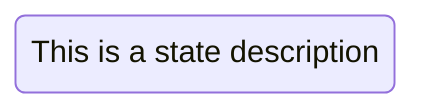
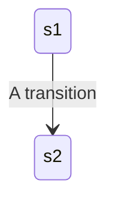
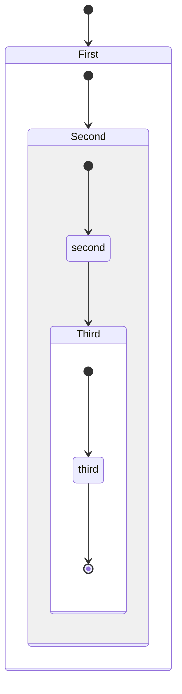
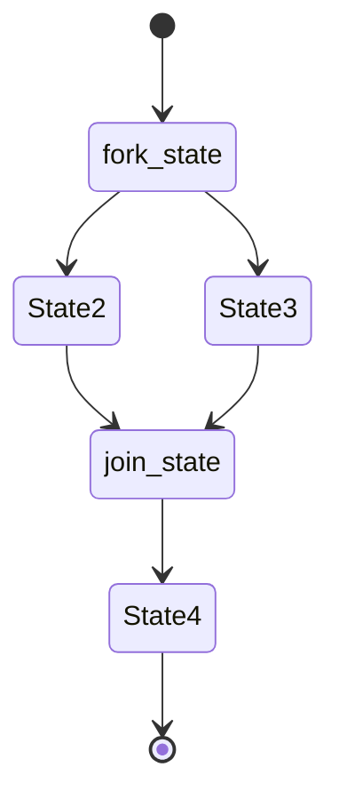
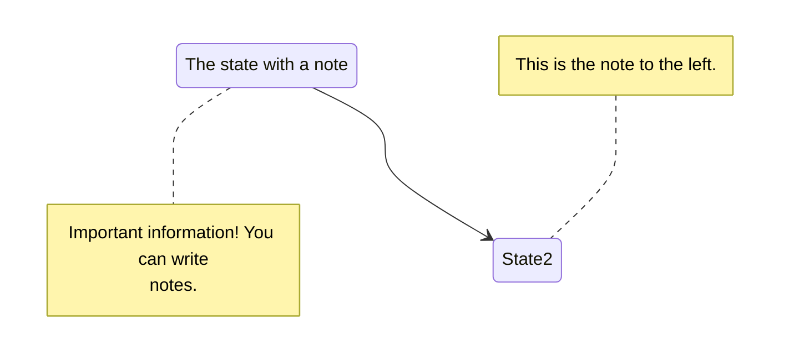
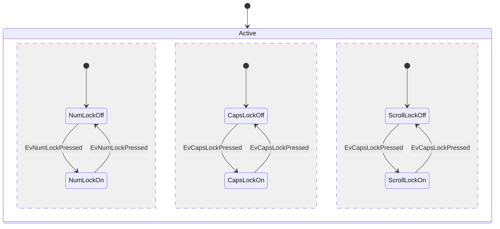

## 状态图

> 状态图是计算机科学及相关领域中用于描述系统行为的一种图, 状态图要求所描述的系统由有限数量的状态组成

使用 `[*]` 表示开始和结束节点

```
stateDiagram
  [*] --> Still
  Still --> [*]

  Still --> Moving
  Moving --> Still
  Moving --> Crash
  Crash --> [*]
```



上图显示了开始, 移动和结束状态

<!-- more -->

### 状态

状态可以直接声明, 也可以使用 `state` 关键字声明

```
stateDiagram
  s1
```



```
stateDiagram
  state "This is a state description" as s2
```



```
stateDiagram
  s2 : This is a state description
```


### 过渡

过渡是一个状态到另外一个状态的方法, 使用 `-->`

```
stateDiagram
  s1 --> s2: A transition
```



### 复合状态

在现实世界中使用状态图时, 通常一个状态可以具有多个内部状态

```
stateDiagram
  [*] --> First

  state First {
    [*] --> Second

    state Second {
      [*] --> second
      second --> Third

      state Third {
        [*] --> third
        third --> [*]
      }
    }
  }
```



可以在复合状态之间过渡, **注意: 不同复合状态的内部状态之间是不能过渡的**

```
stateDiagram
  [*] --> First
  First --> Second
  First --> Third

  state First {
    [*] --> fir
    fir --> [*]
  }
  state Second {
    [*] --> sec
    sec --> [*]
  }
  state Third {
    [*] --> thi
    thi --> [*]
  }
```

### fork

可以使用 `<<fork>><<join>>` 在图中指定一个 fork

```
stateDiagram
  state fork_state <<fork>>
    [*] --> fork_state
    fork_state --> State2
    fork_state --> State3

    state join_state <<join>>
    State2 --> join_state
    State3 --> join_state
    join_state --> State4
    State4 --> [*]
```

<!-- **hexo-filter-mermaid-diagrams 插件不支持 <<>>** -->


### 标记

支持单行或多行标记

```
Note 位置表述 参与者: 标注文字
```

| 位置表述 | 含义 |
| -- | -- |
| right of | 右侧 |
| left of | 左侧 |

```
stateDiagram
  State1: The state with a note
  note right of State1
    Important information! You can write
    notes.
  end note
  State1 --> State2
  note left of State2 : This is the note to the left.
```



### 并行

通过 `--` 符号指定

```
stateDiagram
  [*] --> Active

  state Active {
    [*] --> NumLockOff
    NumLockOff --> NumLockOn : EvNumLockPressed
    NumLockOn --> NumLockOff : EvNumLockPressed
    --
    [*] --> CapsLockOff
    CapsLockOff --> CapsLockOn : EvCapsLockPressed
    CapsLockOn --> CapsLockOff : EvCapsLockPressed
    --
    [*] --> ScrollLockOff
    ScrollLockOff --> ScrollLockOn : EvCapsLockPressed
    ScrollLockOn --> ScrollLockOff : EvCapsLockPressed
  }
```



### 注释

注释必须自己一行, 并且必须以 `%%` (双百分号) 开头

## 参考

- [官方文档](http://mermaid-js.github.io/mermaid/)
