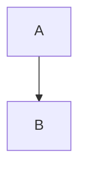
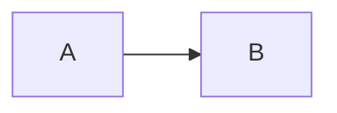
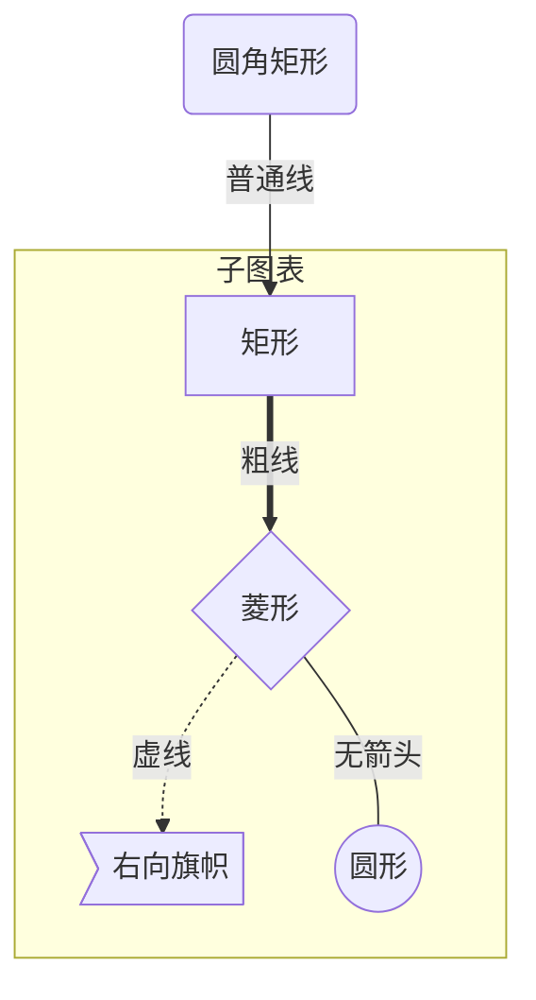
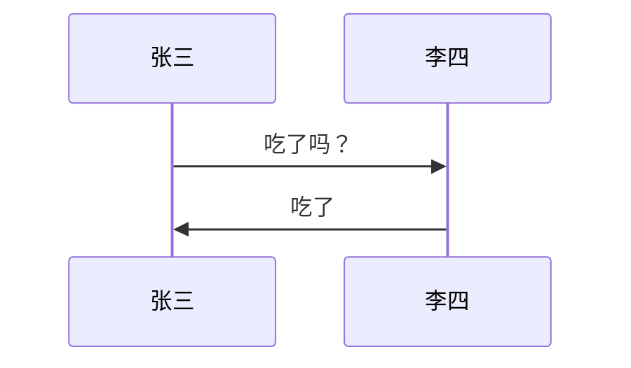
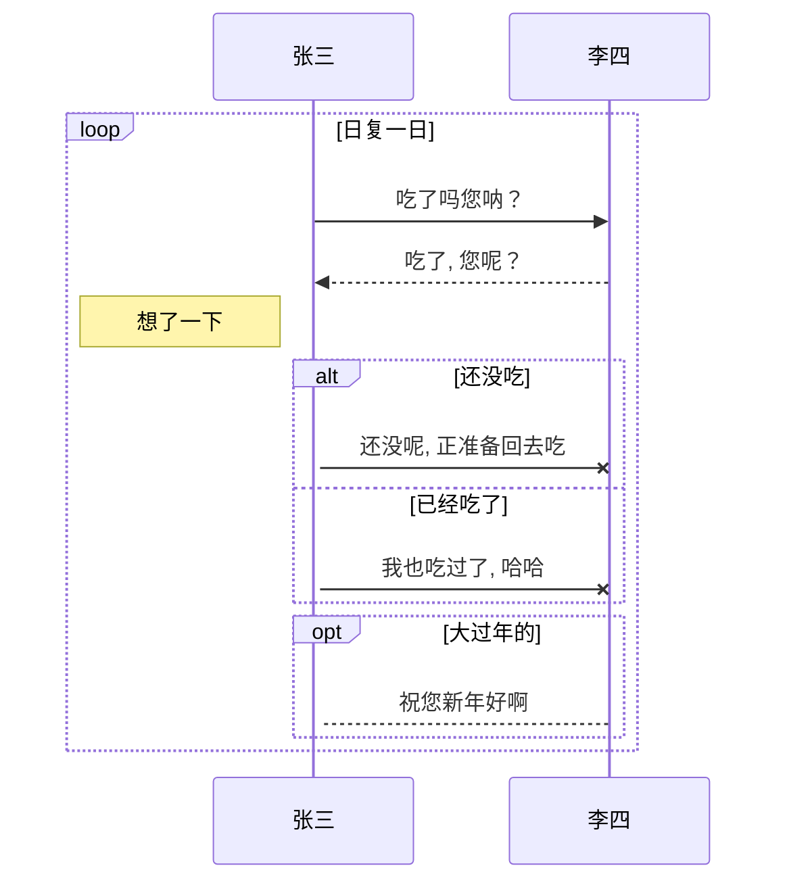
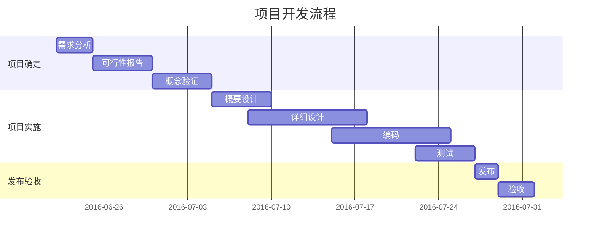

# 简介

[Mermaid](https://github.com/knsv/mermaid) 是一个用于画流程图, 状态图, 时序图, 甘特图的库, 使用 JS 进行本地渲染, 广泛集成于许多 Markdown 编辑器中.

# 流程图

## 图表方向

| 用词 | 含义 |
| -- | -- |
| TB | 从上到下 |
| BT | 从下到上 |
| RL | 从右到左 |
| LR | 从左到右 |

### 语法

`graph 方向描述`

### 例子

#### 从上到下

```
graph TB
  A --> B
```



#### 从左到右

```
graph LR
  A --> B
```



## 节点定义

流程图中每个文本块, 包括开始, 结束, 处理, 判断等. Mermaid 中每个节点都有一个 id, 以及节点的文字.

| 表述 | 说明 |
| -- | -- |
| id[文字] | 矩形节点 |
| id(文字) | 圆角矩形节点 |
| id((文字)) | 圆形节点 |
| id>文字] | 右向旗帜状节点 |
| id{文字} | 菱形节点 |

**注意: 如果节点的文字中包含标点符号, 需要时用双引号包裹起来. **

## 连线

主要表示流程的起始和过程

| 表述 | 说明 |
| -- | -- |
| > | 添加尾部箭头 |
| - | 不添加尾部箭头 |
| – | 单线 |
| –text– | 单线上加文字 |
| == | 粗线 |
| ==text== | 粗线加文字 |
| -.- | 虚线 |
| -.text.- | 虚线加文字 |

## 子图表

使用以下语法添加子图表

```
subgraph 子图表名称
    子图表中的描述语句...
end
```

### 示例



# 序列图

## 语法

```
sequenceDiagram
    [参与者1][消息线][参与者2]:消息体
    ...
```

## 示例

```
sequenceDiagram
    张三->>李四: 吃了吗？
    李四->>张三: 吃了
```



## 参与者

### 简单语法

```
sequenceDiagram
    参与者 1 ->> 参与者2 : 消息体
```

### 声明语法

```
sequenceDiagram
    participant 参与者 1
    participant 参与者 2
    ...
    participant 简称 as 参与者 3
    #该语法可以在接下来的描述中使用简称来代替参与者 3
```

## 消息线

| 类型 | 描述 |
| -- | -- |
| -> | 无箭头的实线 |
| –> | 无箭头的虚线 |
| ->> | 有箭头的实线 |
| –>> | 有箭头的虚线 |
| -x | 末端为叉的实线（表示异步） |
| –x | 末端为叉的虚线（表示异步） |

## 处理状态

在消息线末尾增加 `+` , 则消息接收者进入当前消息的“处理中”状态,
在消息线末尾增加 `-` , 则消息接收者离开当前消息的“处理中”状态.

或者使用以下语法直接说明某个参与者进入“处理中”状态:

```
activate 参与者
```

## 标注

### 语法

```
Note 位置表述 参与者: 标注文字
```

| 位置表述 | 含义 |
| -- | -- |
| right of | 右侧 |
| left of | 左侧 |
| over | 在当中, 可以横跨多个参与者 |

## 逻辑结构

### 判断

```
alt 条件 1 描述
    分支 1 描述语句
else 条件 2 描述 # else 分支可选
    分支 2 描述语句
else ...
    ...
end
```

如果遇到可选的情况, 即没有 else 分支的情况, 使用如下语法:

```
opt 条件描述
    分支描述语句
end
```

### 循环

```
loop 循环的条件
    循环体描述语句
end
```

### 示例

```
sequenceDiagram
    participant z as 张三
    participant l as 李四
    loop 日复一日
        z->>l: 吃了吗您呐？
        l-->>z: 吃了, 您呢？
        activate z
        Note left of z: 想了一下
        alt 还没吃
            z-xl: 还没呢, 正准备回去吃
        else 已经吃了
            z-xl: 我也吃过了, 哈哈
        end
        opt 大过年的
            l-->z: 祝您新年好啊
        end
    end
```



# 甘特图 (gantt)

甘特图是一类条形图, 由 Karol Adamiechi 在 1896 年提出, 而在 1910 年 Henry Gantt 也独立的提出了此种图形表示. 通常用在对项目终端元素和总结元素的开始及完成时间进行的描述.

## 示例

```
gantt
    title 项目开发流程
    section 项目确定
        需求分析       :a1, 2016-06-22, 3d
        可行性报告     :after a1, 5d
        概念验证       : 5d
    section 项目实施
        概要设计      :2016-07-05, 5d
        详细设计      :2016-07-08, 10d
        编码          :2016-07-15, 10d
        测试          :2016-07-22, 5d
    section 发布验收
        发布: 2d
        验收: 3d
```



## 标记

| 标记 | 简介 |
| -- | -- |
| title | 标题 |
| dateFormat | 日期格式 |
| section | 模块 |
| Completed | 已经完成 |
| Active | 当前正在进行 |
| Future | 后续待处理 |
| crit | 关键阶段 |
| 日期缺失 | 默认从上一项完成后 |

# 类图

类图主要是面向对象建模的主要工具.

## 语法

```
classDiagram
    class BankAccount
    BankAccount : +String owner
    BankAccount : +Bigdecimal balance
    BankAccount : +deposit(amount)
    BankAccount : +withdrawl(amount)
```

# 状态图
# 实体关系图
# 饼图

# 参考

- [官方文档](http://mermaid-js.github.io/mermaid/)
- [基于 Mermaid 的时序图, 流程图和甘特图](https://www.iminho.me/wiki/docs/mindoc/mermaid.md)
-