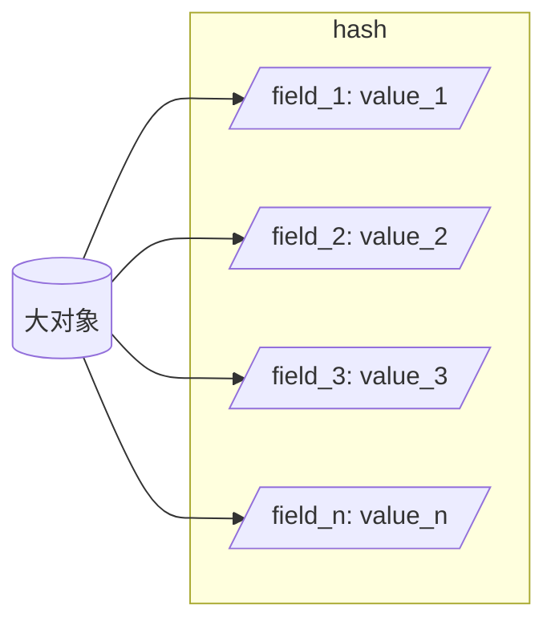
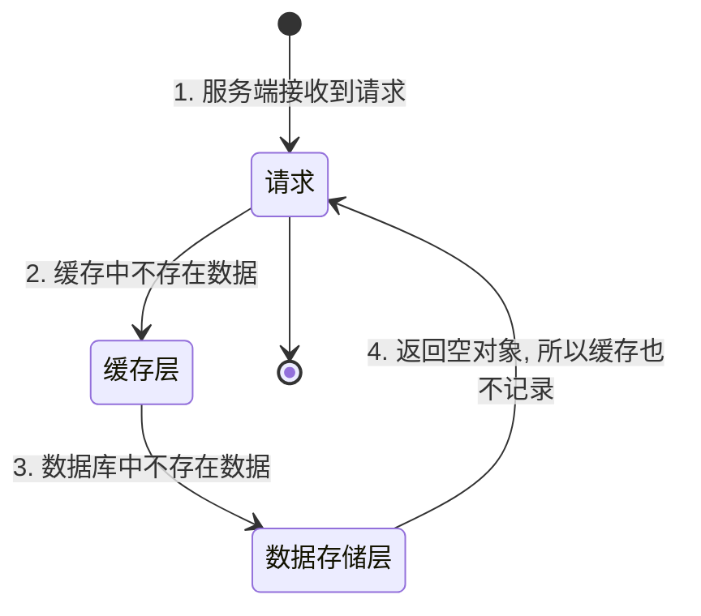
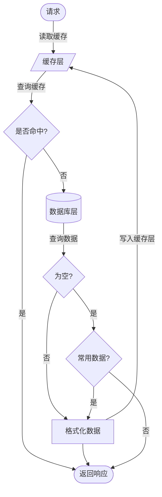

## 简介

在 Redis 分布式缓存使用中, 会碰到许多问题, 这边通过实际使用过程中碰到的问题进行处理

<!-- more -->

## 大对象缓存

大对象的保存和读取过程中都会涉及到大量的 CPU 和网络资源, Redis 官方建议使用哈希 (Hash) 结构去缓存大对象的内容, 把各个属性分别保存到哈希结构的字段 (field) 中, 这样在读取大对象时, 可以按需读取部分内容

如果每个字段保存的依旧是大对象, 这时应该考虑下以下处理方法

- 字段是否需要保存到缓存中
- 能否将对象进一步分解后再进行存储

## 缓存穿透

当请求通过一个键去访问缓存的时候, 如果缓存没有数据, 变会去访问数据库, 数据库也没有数据, 此时接口便会返回空值, 如果没有将当前键进行处理, 就有可能出现缓存穿透

发送缓存穿透的现象是由于大量并发请求访问不存在键, 导致数据库压力巨大, 出现奔溃

解决这个问题就是即使数据库返回空值, 缓存层也需要添加一个具有有效时间的缓存进行保存, 这样就算大量并发请求该键, 也都会由缓存进行处理

常用数据可以避免过多无用的空缓存

## 缓存并发

在使用缓存的过程中, 每个键值对都会设置上过期时间, 如果在有效时间内没有再次命中的话该键便会失效, 当存在高并发访问当前键的时候, 由于缓存中不存在, 所以在高并发中, 从第一个查询到数据并设置到缓存的这个时间段的请求都会去请求数据库, 这样便会导致数据库压力瞬间增大, 影响了数据查询并设置为缓存, 这样循环下去会导致系统奔溃

为了防止出现缓存并发的情况, 可以采用以下几种方式

- 限流: 可以使用 Resilience4j 等框架进行限流, 可以降低数据库的压力, 但是会影响并发性能
- 加锁: 对缓存数据进行加锁, 使得所有并发的请求只能依次访问, 这样在第一次访问时就已经完成数据缓存处理, 后续请求直接访问缓存即可, 但是这也会大大降低并发性能, 并且分布式锁实现困难而且不易维护, 所以这不是个好方法
- 错峰失效: 每个业务都会有各自的高并发阶段, 有了一定规律后对缓存的设置就可以相应的进行处理, 避免在高峰期缓存失效导致数据库压力过高

错峰失效易于实现, 成本低, 可以比较好的应用到各个业务中

## 缓存雪崩

缓存雪崩其实和缓存并发是一样道理的, 在生产环境中, 会有预热数据, 这可以提升系统的性能, 由于缓存都会设置一个固定的时间, 这样会导致在某个时间点有大量缓存失效, 如果这时候出现了大量业务请求, 必然会导致数据库压力巨大, 甚至无响应, 与缓存并发不一样的是, 缓存雪崩是由于大量的缓存失效, 这样造成的效果就如同多个业务同时出现缓存并发的情况, 危及多个应用, 多个数据库

为了避免缓存雪崩的情况, 与缓存并发的解决方法一样, 也是将所有的热点数据进行错峰失效处理

## 小结

分布式缓存既可以提升系统性能, 也会在开发过程中造成影响, 需要注意使用

- 判断当前应用是否需要使用缓存
- 确保缓存单个服务的业务数据, 如果多个业务数据缓存, 会造成业务数据耦合, 非常容易出现缓存不一致的问题
- 预热数据采用错峰失效处理
- 大对象缓存应该要化整为零
- Redis 流水线 (Pipeline) 可以提高传输效率
- 读取数据时, 先读缓存
- 写数据时, 先写数据库再更新缓存, 需要在数据保存完后再清理缓存依赖
