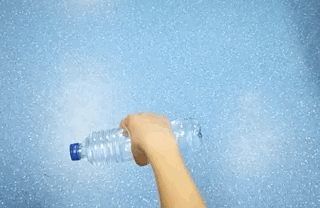
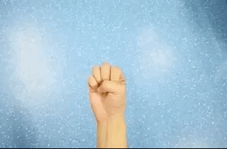
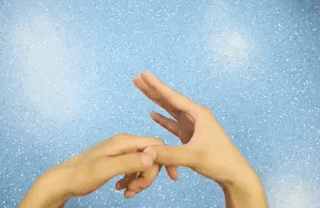
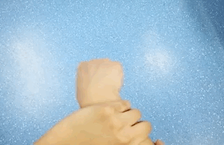
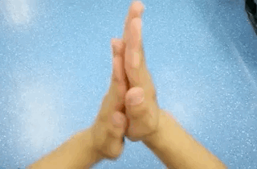

# 什么是大拇指腱鞘炎 (Thumb tenosynovitis) 

大拇指腱鞘炎是一种手部肌腱病症, 是指第一掌骨头部的拇长屈肌腱鞘炎及第 2, 3, 4, 5 指掌骨头部的屈指肌腱腱鞘炎. 拇长屈肌的肌腱在第一掌骨颈部, 进入一个由掌骨掌侧的骨沟与鞘状韧带所构成的狭窄管道. 在第一指骨底部及其尺侧的种子骨, 分别附着于拇短屈肌的浅头及深头, 拇长屈肌腱在二者之间通过. 两个肌腱长期与腱鞘摩擦, 即可引起慢性炎症. 

大拇指 (屈肌肌腱) 腱鞘炎临床上表现, 可分为三期: 

- 第一期: 疼痛期. 表现为手指屈伸时疼痛, 活动时不灵活. 往往在早上时较明显. 在这一期时, 肌腱鞘内发生炎症, 但腱鞘狭窄还不很严重. 
- 第二期: 弹响期. 表现为在前一期的基础上, 手指屈伸不灵活. 屈伸时会出现弹响声, 弹响感. 故名弹响指, 扳机指. 在这一期, 腱鞘的狭窄已经较严重, 肌腱亦出现粗细不等, 肌腱的较粗的部位经过腱鞘的狭窄部, 会出现弹响和疼痛. 检查时可在患指手掌的掌横纹处 (该处亦是腱鞘的狭窄部) . 触摸到一个米粒大小的压痛点, 弹响亦在此处发生. 
- 第三期: 绞锁期. 表现为患病的手指不能屈伸. 在这一期, 肌腱鞘狭窄已经非常严重, 以致肌腱不能在腱鞘内活动. 

# 运动治疗

可以在空闲时间多做做以下几个手部运动, 有一定的缓解作用, 起码手指能适当放松啊. 

- 手握带有负重的水瓶, 首先手掌向上握水瓶, 做从自然下垂到向上抬起动作, 然后是手掌向下握水瓶, 做从下到上的运动, 各10次. 

- 舒展身体各部位时, 也要用力展开双手的五指, 每次20至30秒钟, 做2至3次. 吸足气用力握拳, 用力吐气, 同时急速依次伸开小指, 无名指, 中指, 食指. 左右手各做10次. 

- 用一只手的食指和拇指揉捏另一手手指, 从大拇指开始, 每指各做10秒钟, 平稳呼吸. 
  

- 腕部环转运动, 顺时针, 逆时针转动各20次. 
  

- 双掌合十, 前后运动摩擦致微热. 
  

严重患者一定要及时就医